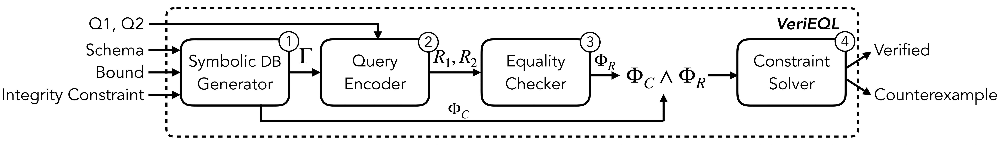
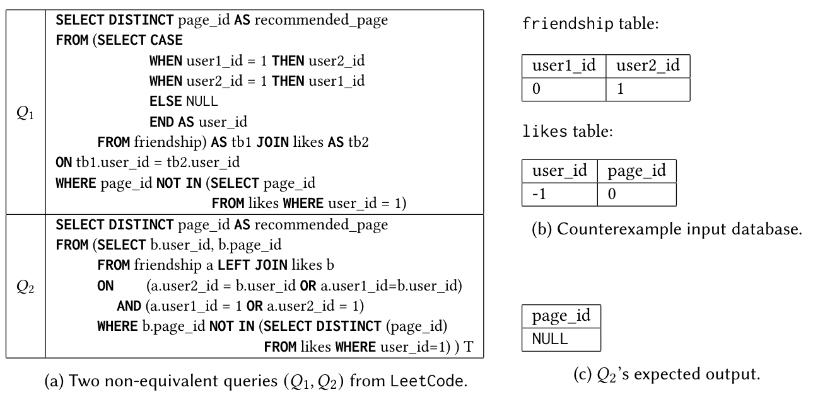
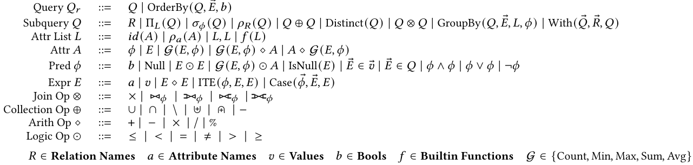
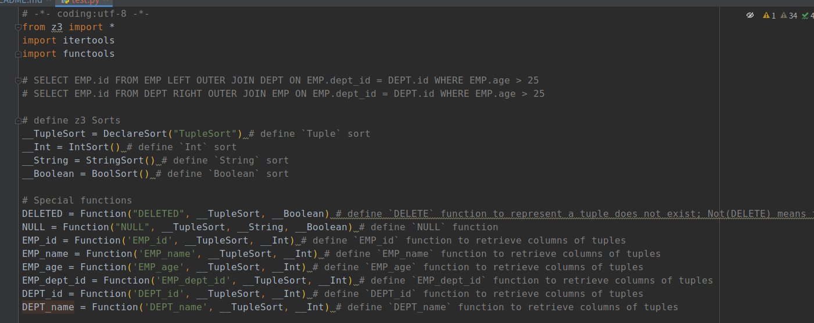

VeriEQL
=======

## 📝 Introduction

VeriEQL is an equivalence verifier for complex SQL queries with integrity constraints using bounded model checking, and
reachs the S.O.T.A. performance over three benchmarks.



A SQL pair refuted by VeriEQL.



## 🛠️ Installation

------------------

### Prerequisites

Python 3.10 or later. (Python 3.11 is recommended.)

To install dependencies, run:

```shell
pip install -r requirements.txt
```

and test your environment with the following command:
```shell
python -m test.test_env
```

### Acceleration

Replacing z3 python scripts with [files](./z3py_libs) in your environments could save 10%~20% time in formulation.

If you use conda, please refer to the following commands.

```shell
sudo mv ./z3py_libs/*.py ~/anaconda3/envs/z3py311/lib/python3.11/site-packages/z3/
```

## 🔖 How to use

1) Try a toy example

```shell
python -m __main__
```

2) Check massive SQL pairs (in parallel) with a 10-min timeout/a max bound size.

```shell
# 10-min timeout
python -m parallel.run_with_max_timeout -f benchmarks/leetcode/leetcode.jsonlines -t 600 -o benchmarks/leetcode/leetcode.out

# 10 bound size
python -m parallel.run_with_max_bound -f benchmarks/leetcode/leetcode.jsonlines -s 10 -o benchmarks/leetcode/leetcode.out
```

## ➕ Supported Features

### Syntax



### Semantics

- List semantic (only works for `OrderBy`)
- Bag semantics

## 🐎 Experiments

-----------------

### Benchmarks

1) [Calcite](./benchmarks/calcite2): 397 pairs

2) [Literature](./benchmarks/literature): 64 pairs

3) [LeetCode](./benchmarks/leetcode): 23,224 pairs

### Baselines

- Bounded Model Checking
    - Cosette
    - Qex
- Testing
    - DataFiller
    - XData
- Fully Prover
    - SPES
    - HoTTSQL

### Comparison

#### RQ1: Coverage and Comparison against State-of-the-Art Techniques

Experimental results on the **ALL** benchmarks.

|       Model       | Unsupported | Checked / Not-refuted / Verified | Refuted / Not-verified |
|:-----------------:|:-----------:|:--------------------------------:|:----------------------:|
| **VeriEQL(ours)** |  **5636**   |            **15200**             |        **3619**        |
|      Cossete      |    24399    |                23                |           33           |
|        Qex        |    24399    |                29                |           27           |
|    DataFiller     |    10722    |              13599               |          134           |
|       XData       |    19451    |               2964               |           1            |
|       SPES        |    24169    |                60                |          226           |
|      HoTTSQL      |    24434    |                21                |           0            |

The results obtained in **03/27/2023** are available [here](experiments/2023_03_27).

#### RQ2: Effectiveness at Generating Counterexamples to Facilitate Downstream Tasks

Experimental results on the **ALL** benchmarks.

|       Model       | Genuine  |   All    |
|:-----------------:|:--------:|:--------:|
| **VeriEQL(ours)** | **3617** | **3619** |
|      Cossete      |    17    |    33    |
|        Qex        |    14    |    27    |
|    DataFiller     |   325    |   325    |
|       XData       |    1     |    1     |

For more details, please read our paper.


## 🔧 Other tools

--------------

### Formula writer

Auto dump formulas of a SQL pair in `test/test.py` for manual inspection.

When instantiate the `Environment` class, please

1) set `verbose=True` to record SQL query equivalence formulas, and
2) set `out_file="YourFilePath"` as the automated script path.



### Spurious counterexample checker

1) install MySQL
2) create MySQL users for parallel checking by [create_mysql_users.py](dbms_checker/create_mysql_users.py)
3) check counterexamples by [counterexample_checker.py](dbms_checker/counterexample_checker.py)

## Citation

-----------

If you use this tool in your research, please cite this project as follows,

```latex
@article{he2024verieql,
  title={VeriEQL: Bounded Equivalence Verification for Complex SQL Queries with Integrity Constraints},
  author={He, Yang and Zhao, Pinhan and Wang, Xinyu and Wang, Yuepeng},
  journal={Proceedings of the ACM on Programming Languages},
  number={OOPSLA1},
  year={2024},
}
```